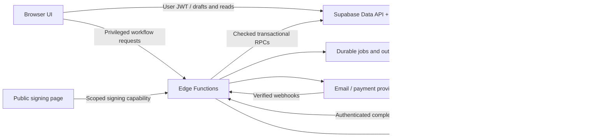

# WispNow production-readiness specification

Version 1 — 12 September 2026. Status: audited implementation plan; implementation has not started.

## 1. Objective and boundaries

Build the existing application and Supabase **Staging** environment to production standards. Preserve the WISP builder, risk assessment, document tools, training library, onboarding, branding, and existing test data while replacing prototype persistence and privileged browser workflows.

- Staging database: `eugsdqwimpocfibmjfxa`.
- Parent/main: `thowcapchyevizbkcofs`; identification context only. This plan does not authorize a merge or production writes.
- Frontend: static JavaScript application deployed using Cloudflare assets.
- Renderer configured by frontend: `https://wisp-renderer-staging.onrender.com`.
- Delivery from this work: this specification, based on source inspection and read-only staging queries. No application code, schema, bucket policies, or hosted configuration was changed.
- All implementation milestones below are to be built and verified on staging first. Promotion is a separate future task.

The target is a trustworthy multi-tenant product: users see only their firm's data; saved means durable; generated and signed documents have a verifiable version; privileged actions are validated on the server; failures are recoverable; advertised features actually work.

## 2. Audit method, evidence, and limits

Inspected `app.js`, `supabase-client.js`, configuration and build files, renderer Node/Python services, migration files, the standalone onboarding questionnaire, and the existing backend plan. Queried live staging policies, function definitions and effective execute privileges, table constraints and columns, buckets, migration count, and deployed Edge Functions. Used the earlier staging advisor/log inspection as supporting evidence. Ran `npm audit --omit=dev --json`.

A read-only transaction using `SET LOCAL ROLE anon` could see metadata for **2 documents objects and 3 WISP PDF objects** in `storage.objects`. This verifies anonymous row visibility under the database role. No file bodies were downloaded and no upload, overwrite, or deletion exploit was performed. The write exposure is established by the policy definitions rather than a destructive test.

Limitations: no authenticated browser walkthrough, live cross-tenant write tests, load tests, restore rehearsal, or renderer penetration test was performed. Hosted renderer environment variables, Supabase Auth configuration, SMTP, billing provider, Cloudflare security headers/Access rules, backup coverage, and deployment pipelines outside the repository remain unverified. Findings distinguish source behavior from hosted configuration. This is an engineering specification, not a legal certification of WISP content or electronic signatures.

Corrections to earlier conversation:

- There are **31 local migration files and 31 staging migration records**, not 34.
- All 23 public app tables have RLS enabled; the old `docs/backend-implementation-plan.md` is outdated about authentication and RLS.
- Different historical migration names on main and staging do not prove why branch metadata said `MIGRATIONS_FAILED`. Obtain the actual deployment failure log and compare statements before diagnosing it. Do not repair migration history by guessing.
- An executable SECURITY DEFINER function is not automatically exploitable: several inspected functions explicitly check the user or a signing token. Trigger functions also cannot simply be treated as ordinary callable RPCs.

## 3. Current application and data model

The product helps firms record security practices, calculate readiness scores, prepare a WISP, collect required signatures and employee acknowledgements, maintain supporting documents, and access training. It already has real Supabase authentication, membership checks, onboarding provisioning, database persistence for several workflows, and hosted rendering integration.

| Domain | Live tables | Current behavior / important boundary |
|---|---|---|
| Workspace | `firms`, `firm_memberships`, `firm_onboarding`, `firm_staff`, `app_settings` | Firm memberships govern app access; staff records represent people, not necessarily login accounts. Settings also contain users, billing, activity and document JSON. |
| Risk | `risk_assessments`, `risk_assessment_answers`, `dashboard_facts` | Browser computes scores and writes parent, answer rows and dashboard in separate operations. |
| WISP | `wisp_projects`, `wisp_answers`, `wisp_generated_files`, `wisp_attachments`, `wisp_signatures`, `wisp_acknowledgement_requests` | Browser owns draft/finalize/upload flow; signatures attach to project, not immutable version. Acknowledgement RPCs use hashed random tokens. |
| Document library | `documents` | Browser uploads files and writes/deletes metadata separately. |
| Supporting records | `terminated_employee_checklists`, `record_retention_policies`, `disaster_recovery_plans`, `incident_reports`, `data_breach_response_guidelines`, `data_breach_notification_letters` | Tables exist but corresponding client save exports are absent; document-instance save is also absent. Several types have a one-row-per-firm constraint despite multi-instance UI. |
| Training | `training_assets`, `training_sign_in_sheets` | Global catalog plus a sheet JSON record; no normalized assignments/completions ledger found. |

Storage: `documents` and `wisp-pdfs` are private buckets; `training-assets` is public. All three have null bucket-level file-size and MIME restrictions. Null does not establish that every platform-wide limit is absent. There are **zero deployed staging Edge Functions**.

Existing assets to preserve: membership RLS helpers; explicit manager checks in acknowledgement management; 32-byte cryptographically random signing tokens hashed with SHA-256; atomic pending-to-signed update; onboarding transaction; dedicated renderer; private workspace buckets; escaped text in many markup paths. Strengthen these instead of rewriting the entire application.

## 4. Findings and required outcomes

Priority definitions: **P0** blocks real customer use due to access, integrity or false-success risk. **P1** is required for launch reliability and complete advertised workflows. **P2** is a measured follow-up or optional feature. Findings marked conditional depend on launch scope or hosted verification.

| ID | Priority | Evidence and impact | Required outcome |
|---|---|---|---|
| SEC-01 | P0 | Live `storage.objects` has 12 `anon can ...` policies: SELECT/INSERT/UPDATE/DELETE for each bucket. Private bucket flags do not compensate. Tenancy migration lines 141–158 removes differently named old policies. | Explicitly remove these policies; assert the entire effective policy set; preserve only intentional platform training reads. |
| SEC-02 | P0 | `private.has_storage_access` checks active membership and slug prefix, not role; every authenticated storage write policy uses it. A viewer therefore satisfies the same file-write predicate as an editor. | Separate file read/write helpers; enforce editor/manager roles and resource ownership. |
| SEC-03 | P0 | File tenancy uses mutable `firms.slug`; firm UPDATE policy allows all manager roles and no inspected column restriction prevents slug changes. File metadata paths are caller-supplied. | Immutable UUID paths for new objects; freeze legacy slugs and enforce exact metadata-to-object ownership. Migrate existing paths with verified copy/cutover, never blind deletion. |
| DOC-01 | P0 | `app.js:50–64,2179–2216` installs no-op save fallbacks. Client lacks exports for six supporting-document saves and `saveSpecialDocumentInstances`. `saveActiveSpecialDocumentInstance` can show success after a swallowed failure. | Implement durable document repositories; fail loudly on missing integrations; success only after database acknowledgement. |
| DATA-01 | P0 | `supabase-client.js:709,902` accepts browser lifecycle status; finalization saves completed status before storage upload and even accepts no file. Project RLS permits general UPDATE. | Database-owned lifecycle and immutable document versions; completion only after verified artifacts exist. |
| SIGN-01 | P0 | `supabase-client.js:862` upserts arbitrary signer name/role/time/data; signature RLS allows editor modification/deletion. `activate_wisp_project` checks presence of two role strings, not version-bound signer identity. | Append-only signatures tied to a document version, authorized signer, consent and server timestamp; atomic activation prerequisites. |
| SIGN-02 | P0 | Live acknowledgement getter resolves the newest project PDF on each open; request snapshot is client-supplied. A previously issued request can refer to changing content. | Bind requests permanently to approved version and artifact hash; no newest-file fallback. |
| SIGN-03 | P0 | `app.js:10674` requests a storage signed URL through the anonymous Supabase client after token RPC lookup. It currently depends on broad anonymous storage access. | Token-authorized Edge endpoint grants access only to the request's version; close anonymous storage and migrate signing together. |
| WEB-01 | P0 | Global localStorage keys at `app.js:1380–1505,1751–1848`; reset at 1915 clears memory but not these keys. Null bootstrap hydrates local data at 2304. | User/firm/environment-scoped recovery state, cleared on logout and account changes; no unowned cache hydration or replay. Verify shared-browser user-switch isolation. |
| DEP-01 | P0 pending runtime assessment | npm audit reports high-severity PDF.js advisory GHSA-hq66-cqwq-w95j for installed dependency. Browser first loads CDN 4.7.76 with local fallback, so lockfile audit alone does not identify deployed runtime exposure. | Inventory actual bundled and CDN versions; select a patched compatible version; bundle matching worker/library; malicious-file regression and fresh audit. |
| RENDER-01 | P0 if hosted auth disabled; P1 regardless | Node renderer auth is opt-in via `WISP_REQUIRE_AUTH === 'true'`; verification checks valid user only, not firm/project. Docker runs Node variant; Python variant has no auth. Hosted flag unverified. | Fail-closed authenticated job boundary; validated project/version input; renderer accepts authorized jobs only. |
| RENDER-02 | P1 | Node renderer has 5 MB body guard but no process deadline/concurrency queue; Chromium uses `--no-sandbox` and file access; errors expose details; some failure paths leak temp dirs; PDF failure can still yield `ok:true`. | Isolated worker, bounded queue and resources, complete cleanup, explicit failure status, no production false-success result. |
| AUTH-01 | P1 | `getActiveFirm` chooses first active membership; provisioning checks then inserts without concurrency protection. Signup trigger provisions a firm for each new user. Invitation UI only edits settings. | Explicit workspace context, idempotent provisioning and real invitation acceptance; invited users must not receive unintended new workspaces. |
| AUTH-02 | P1 | Settings users/permissions and plan state are writable JSON. `can_manage_firm` treats owner/admin/editor alike for settings and staff. UI invitation actions at 9556 do not call Auth Admin APIs. | Role matrix enforced in DB/Edge; separate staff from members; server-managed roles, seats and invitation state. |
| BILL-01 | P0 if billing UI ships | Card form at 8353 reads raw number/CVV in app JS; persists displayed last four/details, not a real provider payment method. Plan selection sets Active locally at 9639. | Hosted payment collection and verified webhooks, or completely disable purchase/payment UI for a non-billing launch. Do not interpret display JSON as entitlements. |
| DATA-02 | P1 | Assessment parent, answers and dashboard are separate writes; WISP draft/answer duplication; full settings JSON read-modify-write; stale answer deletion races. | Transactional aggregate saves and optimistic concurrency; documented canonical sources. |
| DATA-03 | P1 | Cross-entity FKs reference documents/projects independently, without same-firm composite constraints; lifecycle and payload checks are incomplete. | Same-firm references, constrained states, bounded typed payloads, immutable ownership and server audit fields. |
| DATA-04 | P1 | `deleteDocument:501` ignores returned errors; project delete precedes file deletion; uploads can orphan objects. | Idempotent file operation records, compensated failures, retryable cleanup and retention-safe deletion. |
| SEC-04 | P1 | Effective anon EXECUTE remains on authenticated-only RPCs despite historical PUBLIC revokes; broad table grants include TRUNCATE/TRIGGER. Functions generally have internal checks. | Explicit least-privilege grants and defaults; remove unused grants; test effective role privileges. Broad grants alone do not prove HTTP TRUNCATE exposure. |
| SEC-05 | P1 | Rich-text HTML, dynamic markup, signature images and uploaded previews form multiple input/output boundaries. Escaping exists but no centralized rich-text sanitizer was found in reviewed paths. | Allowlisted HTML and URL schemes, strict image decoding, isolated previews, CSP; test hostile persisted content. XSS exploitation not demonstrated in this audit. |
| OPS-01 | P1 | npm has no test/lint scripts; no tracked CI workflow found; build copies config verbatim and does not package local module fallback paths. Old DB apply script points to a missing migration filename and disables certificate verification. | Reproducible tested build and migration runner, staging target assertions, explicit deploy artifact, TLS verification. |
| OPS-02 | P1 | Audit trail is editable settings JSON. No durable job, webhook, notification or application audit tables found. | Trusted audit events, monitoring, retries, alerting, backups and restore evidence. |
| PERF-01 | P1 before scale | Earlier staging advisor: 11 unindexed FKs, 19 overlapping permissive SELECT policies; bootstrap fetches lists and signs URLs eagerly and performs writes. | Read-only paginated bootstrap, lazy URLs, relevant indexes and role-safe query plans. Do not delete unused indexes solely because staging has little traffic. |

## 5. Target architecture and Edge Function allocation

Edge Functions handle HTTP boundaries, secrets, external providers, rate limiting and orchestration. Postgres owns transactions, row ownership, state transitions, uniqueness and audit persistence. Browser validation remains for usability; it never grants authority.

Keep simple tenant-safe reads and bounded draft edits on Supabase with RLS. A mandatory Edge proxy around every SELECT would add latency without fixing weak policies. Move browser multi-table saves into checked transactional RPCs, optionally called through an Edge route when that route adds validation or quota enforcement.

Keep Python/Chromium processing in the existing renderer service after hardening it into a worker. Hosted Edge runtime CPU/memory constraints make that workload a poor fit; Edge should enqueue a durable job and return promptly. See [Edge limits](https://supabase.com/docs/guides/functions/limits). Do not treat an in-memory background promise as a durable queue.

| Proposed endpoint / operation | Authentication and inputs | Responsibility | Acceptance contract |
|---|---|---|---|
| `wisp-generate` POST | User JWT; project ID, expected revision, output kind, idempotency key | Check editor access, schema completeness, quotas; create immutable snapshot and job via RPC | `202 {job_id,version_id,status}`; duplicate key/body returns same job; conflicting body gives 409 |
| `wisp-generation-status` GET | User JWT; job ID | Firm-authorized status with sanitized failure and retry information | Another firm cannot enumerate or inspect job |
| `wisp-generation-complete` POST | Worker credential with job-specific lease/proof | Verify lease, version, expected object location/hash/size, publish artifact and transition state atomically | Duplicate completion harmless; stale lease cannot complete another attempt |
| `wisp-sign` POST | User JWT + verified role assignment, or dedicated signatory capability | Capture consent for exact version; invoke append-only signature transaction | Replay returns same outcome; signer cannot choose another actor/role/version |
| `wisp-activate` POST | User JWT and approved role | Invoke DB transition requiring current-version signatures and usable artifacts | Direct table update cannot bypass prerequisites |
| `acknowledgement-create` POST | Manager JWT; version ID and staff IDs | Resolve recipients from firm_staff, snapshot approved text server-side, create tokens and delivery outbox | No arbitrary staff email/name/snapshot authority; cap recipients; transactional uniqueness |
| `acknowledgement-open` POST | Public request ID + high-entropy capability; no user login required | Verify hash/status/expiry; return minimal display data and short-lived access to exact version | Invalid/revoked/expired capability denied, even when object path is known |
| `acknowledgement-sign` POST | Same scoped capability + bounded signature + consent | Validate submission and atomically consume pending request | Concurrent double-submit produces one signature; durable result supports safe retry |
| `acknowledgement-revoke` POST | Manager JWT | Revoke pending request and future access, record event | Already signed evidence remains immutable |
| `document-upload-init/complete` POST | Editor JWT; firm-owned target, name/type/size | Allocate upload intent and fixed path; validate upload before publishing metadata | Cross-firm path and oversize/disallowed data rejected; incomplete uploads expire |
| `document-download` POST | Member JWT; document/version ID | Authorize resource, issue short-lived URL and optionally record access | Never accept arbitrary bucket/path as authorization |
| `document-delete` POST | Authorized manager/editor subject to retention | Tombstone plus durable cleanup task | Retries safe; signed/evidentiary records protected by retention policy |
| `member-invite/resend/revoke/accept` | Owner/admin JWT; accept requires verified matching identity/capability | Auth Admin/email integration, reserved seats, role assignment and idempotent acceptance | No editor escalation; expired invite rejected; resend invalidates prior capability |
| `member-role/disable` POST | Owner/admin JWT with role ceiling | Atomic role/seat change, last-owner guard, disable/revoke access | Authenticated API obeys changed membership immediately; issued URL TTL is documented |
| `billing-checkout/portal` POST | Billing-authorized JWT; server allowlisted plan ID | Provider session creation using server price map | Caller cannot set price, paid state or customer ID for another firm |
| `billing-webhook` POST | Provider signature on raw body; no user JWT | Idempotent event handling, subscription/entitlement reconciliation | Forged, duplicate and out-of-order events safely handled |
| `notification-dispatch` / `maintenance` | Restricted scheduler/service credential | Outbox delivery, retry/dead-letter handling, expired token/job cleanup | Durable claim/lease; no arbitrary email relay or arbitrary SQL interface |

These are logical operations; combine related operations into a few routed Edge deployments where practical. Maintain separate public capability and user-authenticated boundaries and tests. Do not implement unrelated AI functions: no active AI API integration was found.

Shared contracts: request ID; JSON schema validation; content-type and byte limits; standard 400/401/403/404/409/413/429/500 responses; generic unauthorized-resource errors; CORS allowlist; redacted structured logs; `Cache-Control: no-store` for sensitive responses; idempotency scoped by firm/user/operation plus body hash. Rate limits must be shared across instances, not process-local counters.

Authenticated routes validate user JWTs and active membership. Public signing and provider webhook routes deliberately use their own verified capability/signature instead of assuming a publishable key identifies a user. Keep service credentials server-side, use caller-scoped database clients when possible, and authorize before privileged operations. Document each route's JWT verification configuration and tests using [Supabase authentication guidance](https://supabase.com/docs/guides/functions/auth).

## 6. Access-control specification

Proposed role defaults; finalize product naming before invitation UI implementation:

| Capability | Owner | Admin | Editor | Viewer | Public signer |
|---|---|---|---|---|---|
| Read own firm's permitted records/files | Yes | Yes | Yes | Yes | Assigned version only |
| Edit drafts, upload supporting documents | Yes | Yes | Yes | No | No |
| Manage staff and acknowledgement issuance | Yes | Yes | No by default | No | No |
| Manage members | Yes | Non-owner roles only | No | No | No |
| Billing, ownership transfer, deletion | Yes | No by default | No | No | No |
| Sign as designated WISP officer | Only when designated | Only when designated | Only when designated | Only when designated | Only with designated officer capability |
| Employee acknowledgement | Assigned recipient | Assigned recipient | Assigned recipient | Assigned recipient | Assigned recipient |

Staff titles and membership roles are separate. Ownership does not automatically prove a person is the named officer. Basic/Manager/Administrator labels currently in settings must map explicitly to viewer/editor/admin, or be replaced with consistent names.

Database requirements:

- All tenant tables must check active membership on reads and required role on writes. Child rows derive firm from a trusted parent.
- Ownership IDs, status transitions, signature timestamps, completion metadata, billing state and audit records are not generically browser-writable.
- Prevent `firm_id`/parent reassignment after creation; enforce same-firm exported-document and version references using composite FKs or narrow transaction checks with constraints.
- Replace ALL policies where they unintentionally overlap reads; policy names must reflect actual predicates.
- Revoke authenticated-only RPC execution from both PUBLIC and anon explicitly; set defaults so newly introduced functions/tables are not over-granted. Keep policy helpers callable only where necessary.
- Trigger functions move to private schema where appropriate; SECURITY DEFINER functions use fixed safe search paths, qualified objects and least-privilege owners.
- Public signer functions, if retained behind Edge, cannot remain a bypass around Edge rate limits: revoke public/direct execution after cutover or provide equivalent enforcement inside the remaining exposed RPC.
- UUID object prefix is authoritative. Validate project IDs in paths against the same firm. Metadata cannot point to another firm's object. Legacy slug paths get a documented compatibility window.
- Platform training may remain publicly readable if intentionally public, but only the platform publisher can mutate it. Tenant attachments never share this public access model.

## 7. Data and lifecycle specification

### Canonical records

Retain the existing firm and membership tables. Make `firm_staff` canonical for staff and `firm_memberships` canonical for login permissions. Remove authority from settings JSON copies; during transition they may be derived views only.

For WISP/risk drafts, use existing answer tables as canonical section/question values and migrate existing parent JSON carefully. Parent JSON may remain a derived snapshot but must update inside the same transaction. Add revision numbers and expected-revision checks. Never silently overwrite a newer remote version with a local cache.

Supporting documents should have a canonical multi-instance model: proposed `document_instances(id, firm_id, type, title, schema_version, payload, revision, status, created_by, updated_by, created_at, updated_at)`, with allowlisted type-specific validation. Existing specialized tables become migration sources, not a second writable store. This supports multiple incidents, letters, checklists and policy revisions already represented by the UI. Use `document_instance_versions` for finalized exports and immutable history. Training attendance uses normalized sessions/attendees if completion tracking is in launch scope.

Migrate in steps: inventory database and demonstrably owner-scoped recovery data; copy/backfill; compare counts and representative hashes; switch readers; switch writers; retain old read-only data until verified. Global browser caches have no proven owner; do not automatically upload them to whichever firm logs in next. Do not drop existing tables as a prerequisite for the first safe release.

### Proposed new records

| Record | Minimum fields and invariants |
|---|---|
| `wisp_versions` | project/firm FK, sequential version, source revision, template version, canonical snapshot, SHA-256, state, created_by/time; immutable after ready |
| `generation_jobs` | firm, version, idempotency key/body hash, state, attempt, lease owner/expiry, error code, timestamps; unique scoped idempotency and atomic claim |
| Artifact metadata (extend `wisp_generated_files`) | version ID, bucket/key, kind, size, content hash, renderer/template version, created time; immutable ready artifacts |
| Version-bound signatures | version ID, signer identity or capability reference, reserved role, method, validated signature representation, consent version, server time; append-only |
| Updated acknowledgement requests | version/firm/staff FK, immutable recipient snapshot, token hash, expiry, consumed/revoked times; partial unique pending request per recipient/version; concurrent creation serialized |
| `firm_invitations` | firm, normalized email, intended role, inviter, token hash, expiry, acceptance/revocation, provider state; concurrent seat reservation |
| `audit_events` | firm, trusted actor, action, entity/version, request ID, server timestamp, minimal redacted metadata; append-only and tenant-safe reads |
| `notification_outbox` | firm/entity, message type, deduplication key, provider ID, attempts, next attempt, state; no raw signing capabilities in logs |
| `upload_intents` / cleanup jobs | firm, fixed object key, expected limits, status, expiry and retry state; orphan reconciliation |
| Billing records, if shipped | provider customer/subscription, server plan, status, period; unique provider events; browser read-only entitlements |

### Lifecycle

Draft editing increments a revision. Finalization snapshots that revision and creates a rendering job; a failed render leaves the editable draft and any prior active version intact. A verified artifact moves the new version to ready for signature. Required signatories approve that exact version. Activation is a transactional operation verifying required signatures and ready artifacts. A content change creates a new version and requires fresh approvals; it never rewrites signed content.

Keep separate unsigned content hash and signed-artifact hash so adding signature presentation does not create circular hashing. Record which content the person consented to. Employee acknowledgement references the immutable activated version. Retain previous signed versions with supersession metadata. Define document archival separately from irreversible deletion.

Risk submission accepts question IDs and answers only; server recomputes scores against a versioned questionnaire/ruleset. Draft previews may calculate in the browser using the same pure rules. Dashboard becomes a read model built from canonical data; merely opening home must not create projects or write summary rows. Catalog size is not evidence of training completion.

### Public signing details

Use at least the existing 32 random bytes of token entropy; store only hashes in request records. Exchange a token for a narrowly scoped short session or hold it only in memory; remove it from the address bar after exchange. Avoid analytics/third-party resources on signing routes and set no-referrer/no-store. A signed URL remains usable until its TTL expires: initially target five minutes, with shorter streamed access if immediate revocation is required.

Validate drawn signatures by decoding allowed raster bytes, dimensions and size; reject SVG/HTML/remote URLs. Bound typed signatures and allowlist font keys. Resolve staff IDs from the same firm. Add request limits and per-capability throttles. Server state changes and audit events commit together. Handle repeated completion idempotently without accepting a second signature.

The existing getter updates expired state and then raises an exception; that update rolls back with the exception. Derive expired state on read or use a scheduled transaction rather than depending on that update to persist. Preserve the existing atomic pending-status check used for completion.

## 8. Renderer and file processing

Retain the Node service as the single hosted entry point and retire or explicitly local-scope the Python HTTP variant. Python transformation modules remain internal worker implementation.

The renderer receives a validated immutable snapshot/job descriptor from trusted orchestration, not arbitrary browser signatures, HTML, object paths or remote fetch URLs. Authenticate workers with a dedicated credential and per-job authorization. Avoid giving a Chromium process general service-role access.

Use a durable queue, atomic leases, retry budget and dead-letter state. Initial configurable limits: one rendering process per worker, 120-second process deadline, maximum two automatic retries for transient failures, and capped pages/attachments/output size. Benchmark actual templates before fixing final capacity. Kill child processes on timeout/cancellation and clean all temp directories in finally blocks and a crash-recovery sweep.

Run a minimal non-root container, enforce memory/CPU limits, restrict filesystem and network access, enable browser sandboxing where supported and document compensating container isolation if necessary. Disable arbitrary external resource loading. Validate and sanitize every HTML/URL/image boundary. Minimal public health returns readiness only; internal errors are logged with request IDs and redaction.

File controls: proposed launch limits are 20 MiB per supporting upload, 5 MiB raster logo, 1 MiB signature, 50 MiB total render inputs; tune using real fixtures and product requirements. Enforce limits in bucket configuration and validation, not only browser checks. MIME allowlist and decoded content inspection must agree. Reject active HTML/SVG uploads for inline viewing; scan/quarantine uploads before trusted preview or inclusion in signed output. Serve downloads with safe disposition and isolated preview context.

Persist artifacts before publishing ready metadata. Because Storage and Postgres are not one transaction, model staged object → verified object → published metadata explicitly and reconcile abandoned objects. Never signal completion with empty PDF data. Browser close, refresh and network retries must not lose the generation outcome.

## 9. Frontend and feature completion

Refactor incrementally into auth/workspace, risk, WISP, documents, training, settings, signing and API modules. No framework rewrite is required. Replace dynamically optional persistence exports with explicit imports or an integration check that fails visibly. Standardize saving/saved/offline/failed/conflict states.

Recovery cache keys include environment, user, firm and schema version; clear caches, pending saves, blob URLs and query state on logout or workspace switch. Tag queued saves with their originating identity and revision so a late request cannot write into the next session. Treat network/bootstrap errors as errors, not empty workspaces. Avoid broad localStorage caching of signatures and sensitive documents; implement opt-in scoped offline recovery only if required.

Complete real member invitations, revocation, password recovery, email-change verification and session-expiry handling. Confirm hosted redirect allowlists, SMTP delivery, email confirmation, signup abuse limits, CAPTCHA and MFA policy. Require stronger authentication for owners/admins and sensitive operations as appropriate; do not build custom password storage. Existing leaked-password-protection advisor is an item to enable/verify, not evidence that other hosted Auth settings are configured.

Move plan/service purchases to provider checkout and webhook-backed state. Remove raw card/CVV inputs from our DOM. Keep server price IDs and entitlements authoritative. Until real payment integration is complete, hide/disable purchases and remove misleading payment/renewal confirmation text. Do not store fake success as paid state.

Replace settings activity arrays with the trusted event feed. Implement or clearly remove staff-import placeholders. Training resource labels should match their actual file formats and available content; videos currently mapped to PDFs should not promise a video. If training completion is advertised, add sessions, assignments/attendance, completion timestamps and evidence instead of inferring it from catalog entries.

Bundle pinned browser dependencies, including the PDF worker and DOCX preview assets; stop relying on `node_modules` paths absent from deployed static assets. Current npm audit reported GHSA-hq66-cqwq-w95j and no automatic fix; investigate the [advisory](https://github.com/advisories/GHSA-hq66-cqwq-w95j), choose an available patched release and verify runtime paths rather than running an indiscriminate upgrade.

Add restrictive CSP compatible with the actual PDF/worker paths, remove inline event handlers as needed, restrict connect/frame/worker sources, add no-sniff, referrer and frame protections. Verify deployed response headers because source absence does not prove edge headers are absent. Sanitize stored rich text on input and rendering with an explicit tag/attribute/scheme allowlist. Test hostile links, pasted HTML and signature payloads.

The standalone `onboarding-questionnaire` is a separate static interview/report tool. Its README recommends Cloudflare Access, but enforcement was not verified. Either keep it as a deliberately separate protected internal tool with no implied app sync, or implement authenticated transfer with schema validation. Exclude it from the customer launch bundle until its role is settled.

## 10. Operations, performance and deployment specification

- Generate browser config from a deployment environment manifest containing only public values. Staging frontend, renderer, database, storage, callbacks and provider test modes must agree. Fail build/deploy on an unexpected project ref.
- Replace the obsolete raw DB apply path with versioned migrations and explicit target verification. Do not use `rejectUnauthorized:false` as a production connection policy. `supabase/config.toml` project_id is local configuration identity; do not assume it alone establishes a remote deployment target.
- Establish clean local replay of migrations and compare resulting schema, policies, grants and functions with staging. Historical names/counts are insufficient. Keep forward corrective migrations and a documented baseline strategy; do not mutate main history during this effort.
- Inspect actual branch deployment failure logs as a separate task. Preserve the failure as unresolved until reproduced or explained.
- Add CI: locked dependency install, static checks, meaningful unit tests, local database migrations, role/RLS tests, Edge contract tests, renderer smoke fixtures, production artifact verification and secret/dependency scans. Staging deployment can follow green checks; production promotion is outside this plan's execution.
- Scan tracked/history/build artifacts for credentials using redacted output. The earlier chat-exposed PAT must be revoked if still active. Build only an allowlist of required files; exclude recovery/temp scripts, test data, secrets and unused server sources.
- Introduce cursor pagination, lazy signed URLs and efficient dashboard queries. Add the advisor's relevant FK indexes after examining plans. Verify overlapping policies are consolidated without changing access semantics. Test viewer bootstrap with empty and populated workspaces.
- Add structured events and alerts for render failures/queue lag, auth failures, storage errors, failed migrations, webhook delays, outbox retries and unusual signing failures. Metrics/logs must not include tokens, passwords, payment data, document bodies or signatures.
- Back up both Postgres and file objects; verify whether the selected backup mechanism covers object bodies rather than assuming database backups do. Rehearse restoration into an isolated environment and check document hashes and access controls.
- Proposed launch targets for approval after benchmarking: durable DB recovery point ≤24 hours, service recovery ≤4 hours; normal API p95 ≤1 second; render p95 ≤60 seconds for the agreed reference WISP; 95% ordinary page transitions ≤2 seconds on an agreed device/network. Track upload/render limits separately from metadata latency. These are target criteria, not current measurements or guarantees.
- Assign an operator, retention schedule, support path and incident procedure. Define customer export/deletion, signed-record preservation, provider regions and log retention. Content/legal review should approve the product's readiness language, templates and signature consent before launch; engineering does not assert that a generated PDF establishes regulatory compliance.

## 11. Implementation work packages and dependencies

Each package must contain a scoped source change, forward migration where needed, tests, and a short evidence record. Complete packages in this order, allowing independent UI work after contracts stabilize.

| Package | Deliverables | Depends on | Exit gate |
|---|---|---|---|
| A — Baseline and test harness | Record schema/policy fingerprints; safe environment manifest; isolated test firms/users; local replay; missing-export inventory; document current endpoints | None | Repeatable staging/local checks, targets asserted, no live customer test data |
| B — Tenant and storage boundary | SEC-01/02/03/04; role-specific policies; scoped caches; bucket restrictions; minimal token-authorized download bridge for existing acknowledgements | A | Anonymous private-object reads denied; viewer writes denied; other-firm IDs/paths denied; existing token signing preview still works |
| C — Durable core persistence | DOC-01, DATA-02/03; document_instances and backfill; transactional risk/WISP saves; revision conflicts; read-only bootstrap; server scoring/dashboard | A, B | Every editor survives refresh/relogin/second device; conflicts and failed saves visible; counts/hashes reconciled |
| D — Versioned WISP and renderer | wisp_versions/jobs/artifact records; authenticated Edge orchestration; isolated worker; immutable lifecycle | B, C | Failure/retry/concurrent job tests pass; no completed version without verified artifact; prior active version preserved |
| E — Signatures and acknowledgements | Version-bound signer identity, consent, token exchange, scoped preview, atomic consume/revoke, notification outbox | B, D | Signed version cannot change; replay/concurrency/expiry/revocation tests pass; correct PDF hash on every request |
| F — Real account administration | Invitations/acceptance/revocation, role ceilings, last-owner guards, workspace selection, recovery/email/MFA setup | B, C | Invited user joins intended firm; revoked user loses API access; editor cannot administer members |
| G — Billing and advertised features | Provider checkout/portal/webhooks/entitlements; training evidence if advertised; remove placeholder actions | F, or explicit non-billing launch choice | No raw card form or simulated entitlement; replay-safe webhook tests; every shipped action works |
| H — Hardening and operational proof | PDF dependency/runtime fix, CSP, scan/preview isolation, CI, performance, alerts, restore and accessibility/mobile tests | Start dependency fixes in A; final gate after C–G | All P0/P1 resolved or feature deliberately excluded; evidence recorded; staging sign-off ready |

B's signing download bridge is intentionally implemented with storage closure so removing anonymous policies does not strand recipients. D precedes final signature redesign so signatures bind to a real immutable version. Deployment cleanup and migration history work support staging reproducibility; they are not a request to merge.

## 12. Required verification matrix

Use synthetic firm A and firm B, each with owner/admin/editor/viewer; include disabled member, unconfirmed/no-session user, and public signer. Tests may mutate isolated fixtures only during implementation. Never use a service-role success test as proof of RLS.

| Test family | Required cases and expected evidence |
|---|---|
| Tenant isolation | Cross-firm SELECT/INSERT/UPDATE/DELETE on every exposed table; forged parent ID, firm ID and exported-document FK; membership disable; no access or data leakage |
| Storage | Anonymous list/download/upload/overwrite/delete denied on private buckets; viewer writes denied; prefix and project mismatch denied; training publisher-only mutation; legacy-path continuity |
| Privilege bypass | Direct table status/signature/entitlement updates denied; direct RPC access cannot bypass Edge checks; PUBLIC/anon grants verified after fresh migration replay |
| Auth and tenancy | Signup twice concurrently, refresh, recovery, invite existing/new user, accept twice, expired/revoked invite, last-owner removal, account/workspace switch with queued save |
| Persistence | Every document type and draft on second device; deleted answer really removed; simultaneous edits return 409; denied save never displays Saved; offline recovery never crosses users |
| WISP integrity | Render failure before/after upload, DB completion failure, duplicate callback, worker restart, changed draft during render, duplicate generate request; one stable artifact/version |
| Signing | Wrong token, wrong version, expiry, revocation, reused token, two simultaneous submissions, forged officer, malformed image, HTML/SVG/URL payload; unchanged approved content hash |
| Billing | Forged signature, duplicate/out-of-order event, plan tampering, foreign customer ID, cancellation/payment failure; server entitlements correct |
| Content/preview | Long names, Unicode, long sections, multipage tables, signatures, missing attachment, malicious PDF, hostile rich text; no silent truncation, script execution or external resource fetch |
| Build/deploy | Offline build input consistency; matching PDF worker; all asset references resolve; staging ref asserted; no secrets; headers applied to actual deployed assets/routes |
| Operations | Rate-limit 429 and retry behavior, job timeout/dead-letter, email failure/retry, database/storage outage, alert receipt, isolated restore with checksums |
| UX/accessibility | Keyboard navigation/focus, dialogs, validation announcements, mobile layouts, sign flow, refresh/back navigation, expired session and recoverable error states |

Testing requirements are acceptance criteria for future implementation, not claims that these tests have already passed.

## 13. Product decisions to finalize during implementation

These do not block the security and persistence foundation:

1. Launch with paid subscriptions or disable billing until provider integration? If paid: provider, plan IDs, seats, trial/grace behavior and service-purchase fulfillment owner.
2. Should managers/editors manage staff and issue acknowledgement links, or only owner/admin? The proposed matrix uses owner/admin for these administrative tasks.
3. Can the same individual hold both required signatory roles? How are officers without app accounts verified? Default: explicit recorded role assignment and independent evidence for each required approval.
4. Is one active WISP per firm required? Proposed default: one active version, unlimited archived versions, one current editable project unless product explicitly needs multiple plans.
5. Retention periods, signed-record deletion rules, firm export requirements and support-access policy.
6. Whether training completion/assignment, staff import, and standalone questionnaire integration are launch features. Hide excluded features rather than displaying false success.
7. Approved customer domains, provider region, email sender and operational targets/budget. Verify actual hosted Auth/Cloudflare/Render settings in package A/F/H as appropriate.

## 14. Completion definition

Staging is production-ready when packages A–H applicable to shipped features meet their gates; access-control tests pass under real low-privilege identities; all save paths are durable; signed documents are version-bound and immutable; renderer and external workflows survive retries; shipped dependencies and assets are verified; monitoring and restore are demonstrated; and open product choices have explicit recorded resolutions.

At that point produce a staging readiness report with migration IDs, deployed function versions, build revision, test evidence, remaining exclusions and operating runbooks. **Merging or deploying to main is a separate user-authorized step.**

## 15. Source index

Repository evidence anchors (line numbers refer to the audit snapshot):

- `supabase-client.js:149` signed storage URL helper; `:203` bootstrap; `:375` risk save; `:462` upload; `:501` unchecked delete errors; `:619` workspace JSON; `:642` settings; `:709` draft status; `:862` signatures; `:895` finalization; `:963` deletion; `:1256` active firm selection.
- `app.js:50` missing persistence defaults; `:1380` cache keys; `:1751` supporting document caches; `:1915` reset; `:2179` optional imports; `:2304` local fallback; `:3307` supporting document queue; `:5187` PDF loader; `:8353` payment form; `:9556` simulated invitations; `:9639` simulated plan changes; `:10274` risk scoring; `:10410` signing route/token; `:10674` public preview.
- `scripts/wisp_merge_service.mjs:37` opt-in auth; `:63` user verification; `:656` Chromium pipeline and following route handlers; `scripts/wisp_merge_service.py` alternate HTTP service; `Dockerfile.renderer` selected Node entry point.
- `supabase/migrations/20260803000000_production_tenancy_foundation.sql:43` storage predicate; `:141` incomplete legacy-policy removal; `20260803000001_production_tenancy_function_permissions.sql`; `20260819000000_allow_general_staff.sql` allows null reserved role for general staff.
- `package.json`, `package-lock.json`, `index.html`, `scripts/build-cloudflare-static.mjs`, `scripts/apply-supabase-schema.mjs`, `wrangler.jsonc`, `.env.example`, `onboarding-questionnaire/README.md`.

Live database evidence is the 12 September read-only inspection of `pg_policies`, `pg_proc`, `pg_constraint`, `information_schema`, `storage.buckets`, and migration ledger, plus the anonymous-role object count. Historical staging advisors report 7 anon and 8 authenticated SECURITY DEFINER warnings, leaked-password protection disabled, 11 unindexed FKs and 19 overlapping policy findings. Review exact functions and intended access rather than mechanically revoking every flagged RPC.

Technical references:

- [Supabase Storage access control](https://supabase.com/docs/guides/storage/security/access-control)
- [Supabase Edge Function authentication](https://supabase.com/docs/guides/functions/auth)
- [Supabase Edge Function runtime limits](https://supabase.com/docs/guides/functions/limits)
- [PDF.js advisory GHSA-hq66-cqwq-w95j](https://github.com/advisories/GHSA-hq66-cqwq-w95j)
- [SECURITY DEFINER advisor guidance](https://supabase.com/docs/guides/database/database-linter?lint=0028_anon_security_definer_function_executable)
- [Unindexed FK advisor guidance](https://supabase.com/docs/guides/database/database-linter?lint=0001_unindexed_foreign_keys)

This specification supersedes the older backend implementation plan for current-state assessment and implementation order.
